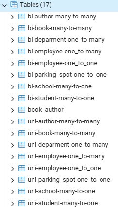

# 🔗 SpringDataJPA
Ejemplos practicos para modelacion y mapeo de los diferentes tipos de relaciones entre entidades usando SpringDataJPA.

## Relaciones
- OneToOne
- ManyToOne
- OneToMany
- ManyToMany

## PostgreSQL

